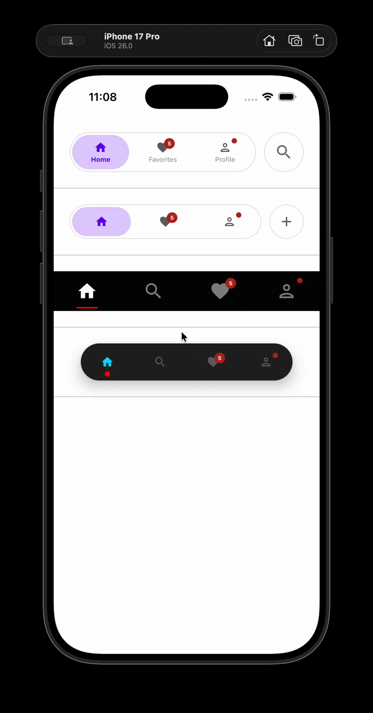

# 🎨 FlowTab

<div align="center">

**A beautiful, animated, and completely framework-agnostic bottom navigation bar for Jetpack Compose and Compose Multiplatform**

[](https://search.maven.org/artifact/io.github.alims-repo/flowtab-cmp)
[](https://opensource.org/licenses/Apache-2.0)
[](http://kotlinlang.org)
[](https://www.jetbrains.com/lp/compose-multiplatform/)

[Features](#-features) • [Installation](#-installation) • [Quick Start](#-quick-start) • [Customization](#-customization) • [Examples](#-integration-examples)

</div>

---

## 🎬 Preview

<div align="center">

### In Action

| Demo 1 | Demo 2 |
|--------|--------|
|  |  |


*Smooth animations, expandable search, and glassmorphism effects*

## ✨ Features

- 🎯 **100% Framework Agnostic** - Works with any navigation solution (Navigation3, Decompose, Voyager, PreCompose, Appyx) or plain Compose state
- 🎨 **Beautiful Animations** - Smooth transitions, scale effects, and fluid search bar expansion
- 🔍 **Built-in Search Bar** - Expandable search with customizable callbacks
- 🎭 **Blur Effects** - Optional glassmorphism with [Haze](https://github.com/chrisbanes/haze) integration
- 🔔 **Badge Support** - Show notification counts or dot indicators
- 🎨 **Customizable Indicators** - Choose from Ripple, Dot, or Line selection indicators
- ⚡ **Lightweight** - Zero navigation dependencies, minimal overhead
- 🎛️ **Highly Customizable** - Extensive styling options with preset configurations
- 📱 **Production Ready** - Battle-tested, performant, and memory-efficient
- 🌐 **Multiplatform** - Android, iOS (iosArm64, iosX64, iosSimulatorArm64)

---

## 📦 Installation

### Gradle (Kotlin DSL) - Recommended

Add to your `libs.versions.toml`:

```toml
[versions]
flowtab-cmp = "0.5.1-beta"

[libraries]
flowtab-cmp = { module = "io.github.alims-repo:flowtab-cmp", version.ref = "flowtab-cmp" }
```

Then in your module's `build.gradle.kts`:

```kotlin
dependencies {
    implementation(libs.flowtab.cmp)
}
```

### Gradle (Groovy)

```groovy
dependencies {
    implementation 'io.github.alims-repo:flowtab-cmp:0.5.1-beta'
}
```

---

## 🚀 Quick Start

Here's a minimal example to get you started:

```kotlin
@Composable
fun MyApp() {
    var selectedScreen by remember { mutableStateOf("home") }

    val navItems = remember {
        listOf(
            NavItem(
                id = "home",
                label = "Home",
                icon = Icons.Outlined.Home,
                selectedIcon = Icons.Filled.Home
            ),
            NavItem(
                id = "search",
                label = "Search",
                icon = Icons.Default.Search,
                type = NavItemType.Search
            ),
            NavItem(
                id = "profile",
                label = "Profile",
                icon = Icons.Outlined.Person,
                selectedIcon = Icons.Filled.Person,
                badge = BadgeData(count = 3)
            )
        )
    }

    Scaffold(
        bottomBar = {
            BottomNavigation(
                items = navItems,
                selectedId = selectedScreen,
                onItemSelected = { item ->
                    selectedScreen = item.id
                }
            )
        }
    ) { padding ->
        Box(modifier = Modifier.padding(padding)) {
            when (selectedScreen) {
                "home" -> HomeScreen()
                "search" -> SearchScreen()
                "profile" -> ProfileScreen()
            }
        }
    }
}
```

**That's it!** FlowTab handles the UI and animations while you control the navigation logic.

---

## 📚 Core Concepts

### Philosophy

FlowTab follows a **presentation-only** architecture. It manages visual state and animations but delegates all navigation decisions to you through simple callbacks:

```kotlin
BottomNavigation(
    items = navItems,           // Define your navigation structure
    selectedId = selectedId,    // YOU control which item is selected
    onItemSelected = { item ->  // YOU handle navigation logic
        selectedId = item.id
        // Navigate, log analytics, show toasts, etc.
    }
)
```

This design makes FlowTab compatible with **any** navigation solution or state management approach.

---

## 🎯 Integration Examples

### With Navigation Compose (androidx.navigation)

```kotlin
@Composable
fun AppWithNavigation() {
    val navController = rememberNavController()
    val navBackStackEntry by navController.currentBackStackEntryAsState()
    val currentRoute = navBackStackEntry?.destination?.route ?: "home"

    Scaffold(
        bottomBar = {
            BottomNavigation(
                items = navItems,
                selectedId = currentRoute,
                onItemSelected = { item ->
                    navController.navigate(item.id) {
                        popUpTo(navController.graph.findStartDestination().id) {
                            saveState = true
                        }
                        launchSingleTop = true
                        restoreState = true
                    }
                }
            )
        }
    ) { padding ->
        NavHost(
            navController = navController,
            startDestination = "home",
            modifier = Modifier.padding(padding)
        ) {
            composable("home") { HomeScreen() }
            composable("search") { SearchScreen() }
            composable("profile") { ProfileScreen() }
        }
    }
}
```

### With Decompose

```kotlin
class RootComponent(
    componentContext: ComponentContext
) : ComponentContext by componentContext {
    private val navigation = StackNavigation<Config>()
    
    val stack: Value<ChildStack<*, Child>> = childStack(
        source = navigation,
        initialConfiguration = Config.Home,
        handleBackButton = true,
        childFactory = ::child
    )
    
    fun navigateTo(config: Config) {
        navigation.bringToFront(config)
    }
    
    sealed class Config {
        object Home : Config()
        object Search : Config()
        object Profile : Config()
    }
}

@Composable
fun AppWithDecompose(component: RootComponent) {
    val stack by component.stack.subscribeAsState()
    val currentConfig = stack.active.configuration
    
    Scaffold(
        bottomBar = {
            BottomNavigation(
                items = navItems,
                selectedId = when (currentConfig) {
                    is RootComponent.Config.Home -> "home"
                    is RootComponent.Config.Search -> "search"
                    is RootComponent.Config.Profile -> "profile"
                },
                onItemSelected = { item ->
                    when (item.id) {
                        "home" -> component.navigateTo(RootComponent.Config.Home)
                        "search" -> component.navigateTo(RootComponent.Config.Search)
                        "profile" -> component.navigateTo(RootComponent.Config.Profile)
                    }
                }
            )
        }
    ) { padding ->
        Children(
            stack = stack,
            modifier = Modifier.padding(padding)
        ) {
            when (val child = it.instance) {
                is Child.Home -> HomeScreen()
                is Child.Search -> SearchScreen()
                is Child.Profile -> ProfileScreen()
            }
        }
    }
}
```

### With Voyager

```kotlin
object HomeTab : Tab {
    override val options: TabOptions
        @Composable get() = TabOptions(index = 0u, title = "Home")
    
    @Composable
    override fun Content() { HomeScreen() }
}

@Composable
fun AppWithVoyager() {
    val tabs = remember { listOf(HomeTab, SearchTab, ProfileTab) }
    
    TabNavigator(tab = HomeTab) { tabNavigator ->
        Scaffold(
            bottomBar = {
                BottomNavigation(
                    items = navItems,
                    selectedId = tabs.indexOf(tabNavigator.current).toString(),
                    onItemSelected = { item ->
                        tabNavigator.current = tabs[item.id.toInt()]
                    }
                )
            }
        ) { padding ->
            CurrentTab(modifier = Modifier.padding(padding))
        }
    }
}
```

---

## 🎨 Customization

### Selection Indicators

Customize how selected items are indicated with three different styles:

#### Ripple Indicator (Default)

A full-width background highlight that fills behind the selected item:

```kotlin
BottomNavigation(
    items = navItems,
    selectedId = selectedId,
    onItemSelected = { item -> selectedId = item.id },
    config = NavConfig(
        navIndicator = NavIndicator.Ripple(
            color = MaterialTheme.colorScheme.primaryContainer,
            indicatorPadding = 4.dp
        )
    )
)
```

#### Dot Indicator

A small circular indicator below the selected item:

```kotlin
BottomNavigation(
    items = navItems,
    selectedId = selectedId,
    onItemSelected = { item -> selectedId = item.id },
    config = NavConfig(
        navIndicator = NavIndicator.Dot(
            size = 8.dp,
            color = MaterialTheme.colorScheme.primary,
            indicatorPadding = 4.dp
        )
    )
)
```

#### Line Indicator

A horizontal line below the selected item:

```kotlin
BottomNavigation(
    items = navItems,
    selectedId = selectedId,
    onItemSelected = { item -> selectedId = item.id },
    config = NavConfig(
        navIndicator = NavIndicator.Line(
            height = 3.dp,
            width = 40.dp,
            color = MaterialTheme.colorScheme.primary,
            indicatorPadding = 4.dp
        )
    )
)
```

**Indicator Comparison:**

- **Ripple**: Best for bold, high-contrast designs. Fills the entire item background.
- **Dot**: Minimal and modern. Perfect for clean, Instagram-style navigation.
- **Line**: Material Design 3 style. Subtle yet clear indication.

### Badges

Add notification counts or dot indicators:

```kotlin
NavItem(
    id = "notifications",
    label = "Notifications",
    icon = Icons.Outlined.Notifications,
    selectedIcon = Icons.Filled.Notifications,
    badge = BadgeData(count = 5)  // Shows "5"
)

NavItem(
    id = "messages",
    label = "Messages",
    icon = Icons.Outlined.Message,
    badge = BadgeData(showDot = true)  // Shows a dot
)
```

### Search Bar

Create an expandable search experience:

```kotlin
val navItems = listOf(
    NavItem(id = "home", label = "Home", icon = Icons.Default.Home),
    NavItem(
        id = "search",
        label = "Search",
        icon = Icons.Default.Search,
        type = NavItemType.Search  // Makes it expandable
    ),
    NavItem(id = "profile", label = "Profile", icon = Icons.Default.Person)
)

BottomNavigation(
    items = navItems,
    selectedId = selectedId,
    onItemSelected = { item -> selectedId = item.id },
    onQueryChange = { query ->
        // Handle real-time search input
        searchViewModel.updateQuery(query)
    },
    onSearch = { query ->
        // Handle search submission (when user presses search button)
        searchViewModel.performSearch(query)
    }
)
```

### Isolated Items (FAB-like)

Add special action buttons that don't participate in navigation selection:

```kotlin
NavItem(
    id = "add",
    label = "Add",
    icon = Icons.Default.Add,
    type = NavItemType.Isolated(rotation = 45f)  // Rotates icon
)
```

### Styling Presets

#### Instagram-Style

```kotlin
val instagramConfig = NavConfig(
    height = 50.dp,
    cornerRadius = 0.dp,
    showLabels = false,
    enableBlur = false,
    showBorder = false,
    navColor = NavColor(
        backgroundColor = Color.Black,
        selectedIconColor = Color.White,
        unSelectedIconColor = Color.Gray
    ),
    navIndicator = NavIndicator.Dot(
        size = 6.dp,
        color = Color.White
    )
)
```

#### Modern Pill Style

```kotlin
val pillConfig = NavConfig(
    height = 60.dp,
    cornerRadius = 60.dp,
    maxWidth = 400.dp,
    enableBlur = true,
    blurIntensity = 0.95f,
    showBorder = true,
    elevation = 8.dp,
    navIndicator = NavIndicator.Ripple(
        color = MaterialTheme.colorScheme.primaryContainer
    )
)
```

#### Floating Minimal

```kotlin
val floatingConfig = NavConfig(
    height = 56.dp,
    cornerRadius = 28.dp,
    showLabels = false,
    elevation = 12.dp,
    maxWidth = 320.dp,
    navIndicator = NavIndicator.Line(
        height = 2.dp,
        width = 40.dp,
        color = MaterialTheme.colorScheme.primary
    )
)
```

### Glassmorphism with Haze

Create beautiful blur effects over scrollable content:

```kotlin
val hazeState = remember { HazeState() }

Scaffold(
    bottomBar = {
        BottomNavigation(
            items = navItems,
            selectedId = selectedId,
            onItemSelected = { /* ... */ },
            hazeState = hazeState,  // Pass the haze state
            config = NavConfig(
                enableBlur = true,
                blurIntensity = 0.95f
            )
        )
    }
) { padding ->
    LazyColumn(
        modifier = Modifier
            .fillMaxSize()
            .padding(padding)
            .hazeChild(state = hazeState)  // Apply to scrollable content
    ) {
        items(100) { index ->
            Text("Item $index")
        }
    }
}
```

### Custom Colors

```kotlin
val customColors = NavColor(
    backgroundColor = Color(0xFF1E1E1E),
    borderColor = Color(0xFF3A3A3A),
    selectedIconColor = Color(0xFF00D9FF),
    unSelectedIconColor = Color(0xFF666666),
    selectedTextColor = Color(0xFF00D9FF),
    unSelectedTextColor = Color(0xFF999999),
    selectedRippleColor = Color(0x3300D9FF)
)

BottomNavigation(
    items = navItems,
    selectedId = selectedId,
    onItemSelected = { /* ... */ },
    config = NavConfig(navColor = customColors)
)
```

---

## 🎭 Item Types

FlowTab supports three item types:

```kotlin
sealed class NavItemType {
    // Regular navigation item
    data object Standard : NavItemType()
    
    // Expandable search bar
    data object Search : NavItemType()
    
    // Modal/dialog trigger (doesn't change selectedId)
    data class Isolated(val rotation: Float = 0f) : NavItemType()
}
```

## 🎯 Indicator Types

FlowTab offers three selection indicator styles:

```kotlin
sealed class NavIndicator {
    // Full-width background highlight
    data class Ripple(
        val color: Color = Color.Red,
        val indicatorPadding: Dp = 4.dp
    ) : NavIndicator()
    
    // Small circular indicator
    data class Dot(
        val size: Dp = 8.dp,
        val color: Color = Color.Red,
        val indicatorPadding: Dp = 4.dp
    ) : NavIndicator()
    
    // Horizontal line indicator
    data class Line(
        val height: Dp = 2.dp,
        val width: Dp = 40.dp,
        val color: Color = Color.Red,
        val indicatorPadding: Dp = 4.dp
    ) : NavIndicator()
}
```

---

## 📖 Configuration Reference

### NavConfig Parameters

| Parameter | Type | Default | Description |
|-----------|------|---------|-------------|
| `height` | Dp | 60.dp | Height of the navigation bar |
| `cornerRadius` | Dp | 60.dp | Corner radius for rounded edges |
| `maxWidth` | Dp | 460.dp | Maximum width (useful for tablets) |
| `iconsSize` | Dp | 20.dp | Size of navigation icons |
| `animationDuration` | Int | 250 | Animation duration in milliseconds |
| `enableBlur` | Boolean | true | Enable glassmorphism blur effect |
| `blurIntensity` | Float | 0.95f | Blur intensity (0.0 to 1.0) |
| `showLabels` | Boolean | true | Show text labels below icons |
| `hideLabelsOnSearchExpand` | Boolean | true | Hide labels when search expands |
| `showBorder` | Boolean | true | Show border around navigation bar |
| `elevation` | Dp | 0.dp | Shadow elevation |
| `navColor` | NavColor | NavColor() | Color configuration |
| `navIndicator` | NavIndicator | NavIndicator.Dot() | Selection indicator style |

---

## 💡 Best Practices

### ✅ Do

```kotlin
// ✅ Keep NavItems stable with remember
val navItems = remember {
    listOf(
        NavItem(id = "home", label = "Home", icon = Icons.Default.Home),
        NavItem(id = "search", label = "Search", icon = Icons.Default.Search)
    )
}

// ✅ Use descriptive, unique IDs
NavItem(id = "user_profile", label = "Profile", icon = Icons.Default.Person)
NavItem(id = "settings_screen", label = "Settings", icon = Icons.Default.Settings)

// ✅ Handle search callbacks appropriately
onQueryChange = { query -> viewModel.updateSearchQuery(query) }
onSearch = { query -> viewModel.performSearch(query) }

// ✅ Match indicator style to your design language
navIndicator = NavIndicator.Line()  // Material Design 3
navIndicator = NavIndicator.Dot()   // Minimal/Instagram style
navIndicator = NavIndicator.Ripple() // Bold/high contrast
```

### ❌ Don't

```kotlin
// ❌ Don't recreate items every composition
val navItems = listOf(NavItem(...))  // Missing remember!

// ❌ Don't use generic or duplicate IDs
NavItem(id = "1", ...)
NavItem(id = "screen", ...)

// ❌ Don't ignore the difference between onQueryChange and onSearch
onQueryChange = { query -> performExpensiveSearch(query) }  // Too frequent!
```

---

## 🧪 Testing

Example unit test:

```kotlin
@Test
fun `bottom navigation handles item selection correctly`() {
    var selectedId = "home"

    composeTestRule.setContent {
        BottomNavigation(
            items = listOf(
                NavItem(id = "home", label = "Home", icon = Icons.Default.Home),
                NavItem(id = "profile", label = "Profile", icon = Icons.Default.Person)
            ),
            selectedId = selectedId,
            onItemSelected = { item -> selectedId = item.id }
        )
    }

    composeTestRule.onNodeWithText("Profile").performClick()
    assertEquals("profile", selectedId)
}
```

---

## 🤝 Contributing

Contributions are welcome! Please follow these steps:

1. Fork the repository
2. Create a feature branch (`git checkout -b feature/amazing-feature`)
3. Commit your changes (`git commit -m 'Add amazing feature'`)
4. Push to the branch (`git push origin feature/amazing-feature`)
5. Open a Pull Request

Please read our [Contributing Guide](https://github.com/Alims-Repo/FlowTab-CMP/blob/main/CONTRIBUTING.md) for more details.

---

## 📄 License

This project is licensed under the Apache License 2.0 - see the [LICENSE](https://github.com/Alims-Repo/FlowTab-CMP/blob/main/LICENSE) file for details.

```
Copyright 2025 Alim

Licensed under the Apache License, Version 2.0 (the "License");
you may not use this file except in compliance with the License.
You may obtain a copy of the License at

    http://www.apache.org/licenses/LICENSE-2.0

Unless required by applicable law or agreed to in writing, software
distributed under the License is distributed on an "AS IS" BASIS,
WITHOUT WARRANTIES OR CONDITIONS OF ANY KIND, either express or implied.
See the License for the specific language governing permissions and
limitations under the License.
```

---

## 🙏 Acknowledgments

- Inspired by modern mobile design patterns and Material Design 3
- Built with [Jetpack Compose](https://developer.android.com/jetpack/compose) and [Compose Multiplatform](https://www.jetbrains.com/lp/compose-multiplatform/)
- Blur effects powered by [Haze](https://github.com/chrisbanes/haze) by Chris Banes
- Icons from [Material Icons Extended](https://fonts.google.com/icons)

---

## 📞 Support & Community

- 🐛 [Report a Bug](https://github.com/Alims-Repo/FlowTab-CMP/issues/new?template=bug_report.md)
- 💡 [Request a Feature](https://github.com/Alims-Repo/FlowTab-CMP/issues/new?template=feature_request.md)
- 💬 [Join Discussions](https://github.com/Alims-Repo/FlowTab-CMP/discussions)
- 📧 Contact: sourav.0.alim@gmail.com

---

## 🌟 Showcase

Using FlowTab in your app? We'd love to feature it! Open an issue with the `showcase` label.

---

<div align="center">

**Made with ❤️ by [Alim](https://github.com/Alims-Repo)**

⭐ **Star this repo if you find it helpful!** ⭐

[⬆ Back to top](#-flowtab)

</div>